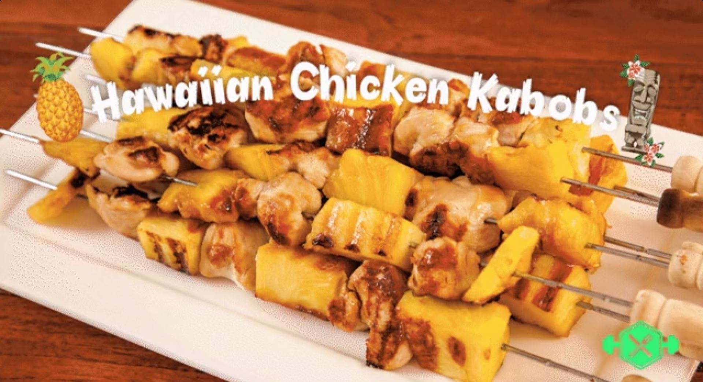

#Hawaiian Chicken Kabobs

### Ingredients:
*   *2 chicken breasts cut into medium pieces (300g)*
*   *20 oz fresh pineapple (550g)*
*   *1.5 tbsp soy sauce*
*   *1.5 tbsp brown sugar*
*   *1 tbsp sherry*
*   *0.5 tbsp sesame oil*
*   *0.5 tsp fresh ginger*
*   *Pinch of garlic powder*
*   *0.5 tsp olive oil*
*   *Lemon juice to taste*

### Directions:
1. In a bowl, combine the soy sauce, brown sugar, sherry, sesame oil, ginger and garlic powder.
2. Add the chicken pieces to the mix. Cut the pineapple into medium sized chunks and add them tot he mix as well.
3. Cover and let sit in the refrigirator for 3 hours (we recommend no more than 3 hours, because after that the pineapple enzymes start to break down the chicken too much).
4. Preheat the grill to medium/high heat.
5. Thread marinated chicken and pineapple chunks alternately onto meat skewers.
6. Pour a bit of olive oil on the preheated grill and grill the kabobs for about 15 minutes. Turn them halfway.
7. Drizzle some lemon juice over the kabobs.
###### *Source: <https://www.reddit.com/r/GifRecipes/comments/5xmuo1/hawaiian_chicken_kabobs/>*
